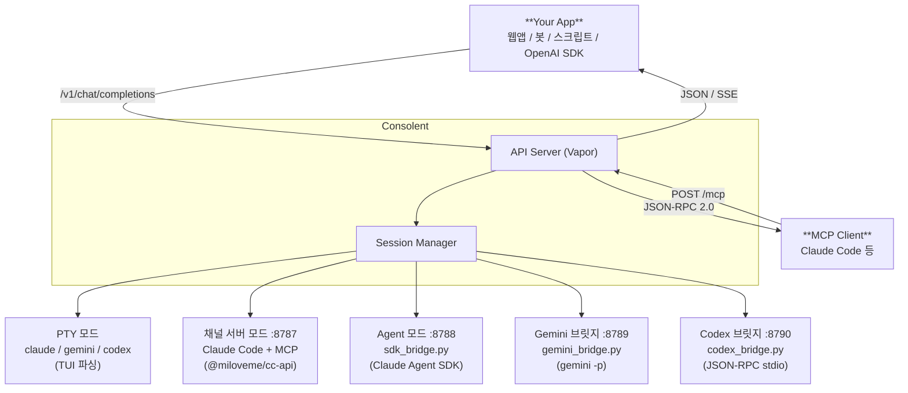

# Consolent

> **Playwright for Terminals** — AI 코딩 CLI 도구를 OpenAI-호환 API로 조작하는 macOS 네이티브 앱

Consolent은 Claude Code, Codex CLI, Gemini CLI 등 터미널 기반 AI 코딩 에이전트를 HTTP/WebSocket API로 제어합니다. PTY(가상 터미널) 직접 구동 외에도, Agent SDK·채널 서버·브릿지 모드를 통해 각 CLI에 최적화된 방식으로 연결할 수 있습니다.



## 왜 Consolent인가

|          | PTY 방식 (Consolent)              | SDK 방식                |
|----------|-----------------------------------|-------------------------|
| CLI 관점  | 사람이 쓰는 것과 동일                | 프로그래밍 호출             |
| 과금      | 기존 구독 그대로                    | 별도 API 과금             |
| 기능 범위  | CLI 전체 기능                      | SDK가 노출하는 범위만       |
| 인증      | 이미 로그인된 상태 사용              | 별도 API key 필요         |
| 확장성    | [Adapter](#term-adapter) 1개 추가 = 새 CLI 지원 | SDK별 개별 통합            |

## 지원 CLI

| CLI 도구    | 상태     | 비고                                |
|-------------|----------|-------------------------------------|
| Claude Code | 완전 구현 | PTY TUI 파싱 + [Agent Mode](#agent-mode) (Claude Agent SDK) |
| Gemini CLI  | 완전 구현 | PTY TUI 파싱 + [Gemini 브릿지](#gemini-브릿지-모드) (`gemini_bridge.py`) |
| Codex CLI   | 완전 구현 | PTY TUI 파싱 + [Codex 브릿지](#codex-브릿지-모드) (`codex_bridge.py`, JSON-RPC) |

---

## 목차

- [빠른 시작](#빠른-시작)
  - [요구 사항](#요구-사항)
  - [설치](#설치)
  - [소스에서 빌드](#소스에서-빌드)
  - [첫 사용](#첫-사용)
- [API 사용법](#api-사용법)
  - [OpenAI 호환 API](#openai-호환-api)
  - [API Reference](#api-reference)
  - [세션 관리 API](#세션-관리-api)
  - [WebSocket 스트리밍](#websocket-스트리밍)
  - [추가 API](#추가-api)
- [세션 모드](#세션-모드)
  - [채널 서버 모드](#채널-서버-모드)
  - [Agent Mode](#agent-mode)
  - [Gemini 브릿지 모드](#gemini-브릿지-모드)
  - [Codex 브릿지 모드](#codex-브릿지-모드)
- [MCP 서버](#mcp-서버)
- [부가 기능](#부가-기능)
  - [Cloudflare Quick Tunnel](#cloudflare-quick-tunnel)
  - [메뉴바 모드](#메뉴바-모드)
- [설정](#설정)
- [아키텍처](#아키텍처)
- [빌드 & 테스트](#빌드--테스트)
- [트러블슈팅](#트러블슈팅)
- [제약 사항](#제약-사항)
- [용어집](#용어집)

---

## 빠른 시작

### 요구 사항

- macOS 14.0+
- Xcode 15.0+
- [XcodeGen](https://github.com/yonaskolb/XcodeGen) (자동 설치)
- Claude Code (또는 Codex/Gemini CLI)가 로컬에 설치 및 로그인된 상태

### 설치

[Releases](https://github.com/miloveme/consolent-swift/releases/latest)에서 `Consolent.dmg`를 다운로드합니다.

1. DMG 마운트 후 `Consolent.app`을 Applications 폴더로 이동
2. 최초 실행 시 아래와 같은 보안 경고창이 뜹니다. **완료**를 클릭하세요.

   

3. **시스템 설정 → 개인정보 보호 및 보안 → 보안** 섹션에서 **"그래도 열기"** 를 클릭하면 앱이 실행됩니다.

   

### 소스에서 빌드

```bash
git clone https://github.com/your/consolent.git
cd consolent

# Xcode 프로젝트 생성 & 열기
./setup.sh
open Consolent.xcodeproj
```

Xcode에서 `Cmd+R`로 빌드 및 실행.

### 첫 사용

1. Consolent 실행 → `Cmd+T`로 새 세션 생성
2. CLI 타입 선택 (Claude Code / Codex / Gemini), 작업 디렉토리 설정
3. 설정(⚙)에서 API Key 확인 (`cst_` prefix)
4. API 요청 시작!

---

## API 사용법

### OpenAI 호환 API

기존 OpenAI SDK/라이브러리로 즉시 사용 가능합니다.

**curl:**

```bash
curl http://localhost:9999/v1/chat/completions \
  -H "Authorization: Bearer cst_YOUR_API_KEY" \
  -H "Content-Type: application/json" \
  -d '{
    "model": "claude-code",
    "messages": [{"role": "user", "content": "이 프로젝트의 구조를 설명해줘"}]
  }'
```

**Python (OpenAI SDK):**

```python
from openai import OpenAI

client = OpenAI(
    base_url="http://localhost:9999/v1",
    api_key="cst_YOUR_API_KEY"
)

response = client.chat.completions.create(
    model="claude-code",
    messages=[{"role": "user", "content": "테스트 실패 원인 찾아서 수정해줘"}]
)
print(response.choices[0].message.content)
```

**JavaScript (OpenAI SDK):**

```javascript
import OpenAI from "openai";

const client = new OpenAI({
  baseURL: "http://localhost:9999/v1",
  apiKey: "cst_YOUR_API_KEY",
});

const response = await client.chat.completions.create({
  model: "claude-code",
  messages: [{ role: "user", content: "src/auth.ts 코드 리뷰해줘" }],
});
console.log(response.choices[0].message.content);
```

**Python (스트리밍):**

```python
from openai import OpenAI

client = OpenAI(
    base_url="http://localhost:9999/v1",
    api_key="cst_YOUR_API_KEY"
)

stream = client.chat.completions.create(
    model="claude-code",
    messages=[{"role": "user", "content": "이 프로젝트의 구조를 설명해줘"}],
    stream=True
)
for chunk in stream:
    if chunk.choices[0].delta.content:
        print(chunk.choices[0].delta.content, end="", flush=True)
```

**curl (스트리밍):**

```bash
curl -sN http://localhost:9999/v1/chat/completions \
  -H "Authorization: Bearer cst_YOUR_API_KEY" \
  -H "Content-Type: application/json" \
  -d '{
    "model": "claude-code",
    "messages": [{"role": "user", "content": "이 프로젝트의 구조를 설명해줘"}],
    "stream": true
  }'
```

**모델 목록 조회:**

```bash
curl http://localhost:9999/v1/models \
  -H "Authorization: Bearer cst_YOUR_API_KEY"
```

```json
{
  "object": "list",
  "data": [
    {"id": "claude-code", "object": "model", "owned_by": "consolent"},
    {"id": "codex", "object": "model", "owned_by": "consolent"},
    {"id": "gemini", "object": "model", "owned_by": "consolent"},
    {"id": "channel-session", "object": "model", "owned_by": "channel"}
  ]
}
```

> 채널 서버 모드 세션은 `owned_by: "channel"`, Agent 모드는 `owned_by: "agent"`, 브릿지 모드는 `owned_by: "bridge"`로 표시됩니다.

---

### API Reference

모든 요청에 `Authorization: Bearer cst_YOUR_API_KEY` 헤더가 필요합니다.

#### POST /v1/chat/completions

**Request Body:**

| 파라미터             | 타입              | 필수 | 기본값   | 설명                                      |
|---------------------|-------------------|------|---------|-------------------------------------------|
| `messages`          | `array`           | O    |         | 메시지 배열 (마지막 `user` 메시지를 전송)     |
| `model`             | `string`          |      |         | 모델 ID (`claude-code`, `codex`, `gemini`) |
| `stream`            | `boolean`         |      | `false` | SSE 스트리밍 활성화                          |
| `timeout`           | `integer`         |      | `300`   | 응답 대기 타임아웃 (초)                       |
| `temperature`       | `number`          |      |         | 호환성 위해 수용 (무시됨)                     |
| `max_tokens`        | `integer`         |      |         | 호환성 위해 수용 (무시됨)                     |
| `top_p`             | `number`          |      |         | 호환성 위해 수용 (무시됨)                     |
| `n`                 | `integer`         |      |         | 호환성 위해 수용 (무시됨)                     |
| `stop`              | `string`/`array`  |      |         | 호환성 위해 수용 (무시됨)                     |
| `presence_penalty`  | `number`          |      |         | 호환성 위해 수용 (무시됨)                     |
| `frequency_penalty` | `number`          |      |         | 호환성 위해 수용 (무시됨)                     |
| `user`              | `string`          |      |         | 호환성 위해 수용 (무시됨)                     |

> CLI 도구가 직접 생성하므로 `temperature`, `max_tokens` 등 생성 파라미터는 Consolent이 제어하지 않습니다.

**`messages` 형식:**

```json
// 문자열
{"role": "user", "content": "안녕"}

// 배열 (OpenAI vision 호환)
{"role": "user", "content": [{"type": "text", "text": "안녕"}]}
```

**응답 (비스트리밍):**

```json
{
  "id": "chatcmpl-m_x1y2z3",
  "object": "chat.completion",
  "created": 1710460800,
  "model": "claude-code",
  "choices": [
    {
      "index": 0,
      "message": {"role": "assistant", "content": "응답 텍스트..."},
      "finish_reason": "stop"
    }
  ],
  "usage": {"prompt_tokens": 0, "completion_tokens": 0, "total_tokens": 0}
}
```

> `usage` 필드는 호환성 위해 포함되며 항상 `0`입니다. CLI 도구가 토큰 수를 노출하지 않기 때문입니다.

**응답 (스트리밍, `stream: true`):**

`Content-Type: text/event-stream` 으로 SSE 형식 반환:

```
data: {"id":"chatcmpl-m_x1y2z3","object":"chat.completion.chunk","created":1710460800,"model":"claude-code","choices":[{"index":0,"delta":{"role":"assistant"},"finish_reason":null}]}

data: {"id":"chatcmpl-m_x1y2z3","object":"chat.completion.chunk","created":1710460800,"model":"claude-code","choices":[{"index":0,"delta":{"content":"응답 텍스트..."},"finish_reason":null}]}

data: {"id":"chatcmpl-m_x1y2z3","object":"chat.completion.chunk","created":1710460800,"model":"claude-code","choices":[{"index":0,"delta":{},"finish_reason":"stop"}]}

data: [DONE]
```

> 200ms 간격으로 헤드리스 터미널 버퍼를 폴링하여 새 콘텐츠를 delta로 전송합니다.

**에러:**

| 상태 코드 | 원인                         |
|----------|------------------------------|
| `400`    | `messages`가 비어있거나 `user` 메시지 없음 |
| `401`    | API Key 누락 또는 불일치         |
| `410`    | 채널 서버 / Agent / 브릿지 모드 세션 — 해당 서버 URL로 직접 요청 필요 |
| `503`    | 준비된 세션 없음 (앱에서 세션 먼저 생성 필요) |

---

### 세션 관리 API

#### 세션 생성

```bash
curl -X POST http://localhost:9999/sessions \
  -H "Authorization: Bearer cst_YOUR_API_KEY" \
  -H "Content-Type: application/json" \
  -d '{
    "working_directory": "/path/to/project",
    "cli_type": "claude-code",
    "auto_approve": false,
    "channel_enabled": false
  }'
```

```json
{
  "session_id": "s_a1b2c3",
  "status": "initializing",
  "channel_enabled": false,
  "channel_url": null,
  "created_at": "2026-03-14T10:00:00Z"
}
```

> `channel_enabled`, `channel_port`, `channel_server_name`은 Claude Code 전용 옵션입니다. 자세한 내용은 [채널 서버 모드](#채널-서버-모드)를 참조하세요.

#### 세션 목록

```bash
curl http://localhost:9999/sessions \
  -H "Authorization: Bearer cst_YOUR_API_KEY"
```

#### 메시지 전송 (동기)

```bash
curl -X POST http://localhost:9999/sessions/s_a1b2c3/message \
  -H "Authorization: Bearer cst_YOUR_API_KEY" \
  -H "Content-Type: application/json" \
  -d '{"text": "코드 리뷰해줘", "timeout": 120}'
```

```json
{
  "message_id": "m_x1y2z3",
  "response": {
    "text": "코드를 분석해봤습니다...",
    "files_changed": ["src/auth.ts"],
    "duration_ms": 4500
  }
}
```

#### 세션 종료

```bash
curl -X DELETE http://localhost:9999/sessions/s_a1b2c3 \
  -H "Authorization: Bearer cst_YOUR_API_KEY"
```

---

### WebSocket 스트리밍

```javascript
const ws = new WebSocket(
  "ws://localhost:9999/sessions/s_a1b2c3/stream?token=cst_YOUR_API_KEY"
);

ws.onmessage = (e) => {
  const data = JSON.parse(e.data);
  switch (data.type) {
    case "output":
      console.log(data.text); // 실시간 CLI 출력
      break;
    case "approval_required":
      console.log(`승인 필요: ${data.prompt}`);
      ws.send(JSON.stringify({ type: "approve", id: data.id, approved: true }));
      break;
    case "status":
      console.log(`상태: ${data.status}`);
      break;
  }
};

// 메시지 전송
ws.send(JSON.stringify({ type: "input", text: "파일 분석해줘" }));
```

---

### 추가 API

#### Raw 입력

```bash
# 텍스트 입력
curl -X POST http://localhost:9999/sessions/s_a1b2c3/input \
  -H "Authorization: Bearer cst_YOUR_API_KEY" \
  -d '{"text": "/help\n"}'

# 특수 키
curl -X POST http://localhost:9999/sessions/s_a1b2c3/input \
  -H "Authorization: Bearer cst_YOUR_API_KEY" \
  -d '{"keys": ["ctrl+c"]}'
```

지원 키: `ctrl+c`, `ctrl+d`, `ctrl+z`, `ctrl+l`, `enter`, `tab`, `escape`, `up`, `down`, `left`, `right`

#### 출력 버퍼

```bash
curl http://localhost:9999/sessions/s_a1b2c3/output \
  -H "Authorization: Bearer cst_YOUR_API_KEY"
```

#### 승인 확인 & 응답

```bash
# 대기 중 승인 확인
curl http://localhost:9999/sessions/s_a1b2c3/pending \
  -H "Authorization: Bearer cst_YOUR_API_KEY"

# 승인 응답
curl -X POST http://localhost:9999/sessions/s_a1b2c3/approve/a_1 \
  -H "Authorization: Bearer cst_YOUR_API_KEY" \
  -d '{"approved": true}'
```

---

## 세션 모드

Consolent은 CLI별로 다양한 실행 모드를 지원합니다. PTY 모드는 모든 CLI에서 동작하는 기본 방식이며, 각 CLI에 최적화된 브릿지/채널/Agent 모드를 선택적으로 활성화할 수 있습니다.

| 모드 | 대상 CLI | API 엔드포인트 | 특징 |
|------|---------|--------------|------|
| PTY (기본) | 모두 | `localhost:9999` | TUI 파싱, 모든 CLI 지원 |
| 채널 서버 | Claude Code | `localhost:8787` | MCP 서버 직접 응답, PTY 파싱 없음 |
| Agent Mode | Claude Code | `localhost:8788` | Claude Agent SDK, 이미지 지원 |
| Gemini 브릿지 | Gemini CLI | `localhost:<port>` | `gemini -p` 파이프 모드 |
| Codex 브릿지 | Codex CLI | `localhost:<port>` | JSON-RPC `app-server` 모드 |

PTY 이외의 모드로 동작 중인 세션에 Consolent API(`localhost:9999`)를 통해 요청하면 `410 Gone`으로 해당 서버 URL을 안내합니다.

---

### 채널 서버 모드

Claude Code 세션에서 **채널 서버 모드**를 활성화하면, [`@miloveme/claude-code-api`](https://www.npmjs.com/package/@miloveme/claude-code-api) MCP 채널 서버가 Claude Code 내부에서 직접 OpenAI 호환 API를 제공합니다. 기존 PTY 파싱 방식을 거치지 않으므로 더 안정적이고 빠릅니다.

```
┌─ Your App ──┐                        ┌─ Consolent ──────────────────────────┐
│             │  http://localhost:8787  │  Claude Code (PTY)                   │
│  OpenAI SDK │ ──────────────────────▶ │    └─ MCP Channel Server             │
│             │ ◀────────────────────── │       └─ @miloveme/claude-code-api   │
└─────────────┘     JSON Response      └──────────────────────────────────────┘
```

#### 사용법

1. **세션 생성** → CLI 타입 `Claude Code` 선택
2. **Channel Server** 토글 ON
3. `~/.claude.json`에 MCP 서버 설정이 없으면 **Install** 버튼으로 자동 설치 (백업 + Undo 지원)
4. 세션 생성 → 개발 채널 선택 화면 자동 통과 → Claude Code TUI 시작
5. 채널 서버 URL (`http://localhost:8787`)로 직접 API 요청

#### MCP 서버 설정

`~/.claude.json`의 `mcpServers`에 다음 항목이 필요합니다 (Install 버튼으로 자동 추가 가능):

```json
{
  "mcpServers": {
    "openai-compat": {
      "command": "npx",
      "args": ["-y", "@miloveme/claude-code-api@latest"],
      "env": {
        "OPENAI_COMPAT_API_KEY": "cst_YOUR_API_KEY"
      }
    }
  }
}
```

Install 시 Consolent의 API 키가 `OPENAI_COMPAT_API_KEY`에 자동 설정됩니다. 기존 설정에 API 키만 빠져 있으면 "API key 적용" 버튼으로 추가할 수 있습니다.

#### API에서 채널 세션 생성

```bash
curl -X POST http://localhost:9999/sessions \
  -H "Authorization: Bearer cst_YOUR_API_KEY" \
  -H "Content-Type: application/json" \
  -d '{
    "working_directory": "/path/to/project",
    "cli_type": "claude-code",
    "channel_enabled": true,
    "channel_port": 8787,
    "channel_server_name": "openai-compat"
  }'
```

```json
{
  "session_id": "s_a1b2c3",
  "status": "initializing",
  "channel_enabled": true,
  "channel_url": "http://localhost:8787"
}
```

채널 세션으로 Consolent API를 통해 요청하면 채널 URL로 안내됩니다:

```bash
curl http://localhost:9999/v1/chat/completions \
  -d '{"model": "channel-session-name", "messages": [...]}'
# → 410 Gone: "Use http://localhost:8787/v1"
```

여러 채널 세션을 생성하면 포트가 자동 증가합니다 (8787, 8788, ...).

---

### Agent Mode

Claude Code 세션에서 **Agent 모드**를 활성화하면, Consolent이 Python SDK 브릿지 서버(`tools/sdk-bridge/sdk_bridge.py`)를 서브프로세스로 실행합니다. 브릿지 서버가 Claude Agent SDK를 통해 Claude Code CLI와 통신하고, OpenAI 호환 API를 `http://localhost:<sdkPort>`에서 제공합니다.

PTY 파싱 없이 공식 SDK를 사용하므로 안정적이며, 이미지/파일 첨부(Vision API 형태)와 실시간 스트리밍을 지원합니다.

```
유저 앱 (Cursor 등)  ←직접 HTTP→  Agent API 서버 (OpenAI 호환)  ←stdin/stdout→  Claude Code CLI
                                     스트리밍 + 이미지 지원           (Claude Agent SDK)
         ↕
   Consolent 터미널 UI  ←채팅 버블 로그→  Agent API 서버
```

#### 사용법

1. **새 세션** → CLI 타입 `Claude Code` 선택
2. **Agent Mode** 토글 ON (채널/PTY 중 선택)
3. Agent 서버 포트, 모델, 권한 모드 설정
4. 세션 생성 → Agent 서버가 시작되면 URL이 상태바에 표시됨 (`http://localhost:8788`)
5. 해당 URL로 직접 API 요청 (스트리밍, 이미지 지원)

Agent 세션으로 Consolent API(`localhost:9999`)에 요청하면 410 Gone으로 Agent 서버 URL을 안내합니다:

```bash
curl http://localhost:9999/v1/chat/completions \
  -d '{"model": "my-agent-session", "messages": [...]}'
# → 410 Gone: "Session is in Agent mode. Send requests directly to http://localhost:8788/v1"
```

#### 브릿지 의존성 설치

```bash
# 공용 가상환경 생성 (Settings → 브릿지 탭에서도 가능)
python3 -m venv ~/.consolent/sdk-venv
~/.consolent/sdk-venv/bin/pip install claude-agent-sdk aiohttp
```

#### PTY 모드와 비교

| 항목 | PTY 모드 | Agent 모드 |
|------|---------|-----------|
| API 엔드포인트 | `localhost:9999` (Consolent) | `localhost:8788` (Agent 서버) |
| 응답 방식 | 터미널 출력 파싱 | Claude Agent SDK 직접 응답 |
| 이미지 첨부 | 임시 파일 저장 필요 | Base64 data URI 직접 전달 |
| 스트리밍 | 200ms 폴링 | SDK 이벤트 → SSE |
| 안정성 | TUI 파싱 의존 | 공식 SDK 사용 |

---

### Gemini 브릿지 모드

Gemini CLI 세션에서 **브릿지 모드**를 활성화하면, Consolent이 Python 브릿지 서버(`tools/gemini-bridge/gemini_bridge.py`)를 서브프로세스로 실행합니다. 브릿지 서버는 `gemini -p` (파이프 모드)로 Gemini CLI를 호출하고, OpenAI 호환 API를 `http://localhost:<port>`에서 제공합니다.

```
유저 앱  ←직접 HTTP→  Gemini Bridge API 서버  ←subprocess→  gemini -p <prompt>
```

- 브릿지 서버가 요청당 `gemini -p "<prompt>"` 프로세스를 실행
- 프로세스 종료 후 stdout 전체를 수집하여 응답 반환
- Consolent 터미널에는 채팅 버블 형태로 요청/응답 표시

#### 의존성 설치

```bash
# 공용 가상환경에 aiohttp만 필요 (Gemini CLI 자체가 처리)
~/.consolent/sdk-venv/bin/pip install aiohttp
```

---

### Codex 브릿지 모드

Codex CLI 세션에서 **브릿지 모드**를 활성화하면, Consolent이 Python 브릿지 서버(`tools/codex-bridge/codex_bridge.py`)를 서브프로세스로 실행합니다. 브릿지 서버는 `codex app-server --listen stdio://`를 실행하고 JSON-RPC over stdio로 통신합니다.

```
유저 앱  ←직접 HTTP→  Codex Bridge API 서버  ←JSON-RPC stdio→  codex app-server
```

- `codex app-server --listen stdio://`로 서버 모드 Codex 실행
- JSON-RPC `thread/start` + `turn/start` + `delta` 이벤트로 대화 처리
- 스트리밍 델타를 실시간으로 SSE로 전달

#### 브릿지 출력 레벨

세 브릿지 모두 **Settings → 브릿지 탭 → 브릿지 출력 레벨**로 제어:

| 레벨 | 표시 내용 |
|------|---------|
| `error` | 오류 메시지만 |
| `info` | 상태 메시지 + 대화 내용 (기본값) |
| `debug` | 원시 CLI 출력 포함 (`[Gemini 원시]`, `[Codex RPC]`, `[SDK]`) |

> 대화 내용(user/assistant 버블)은 레벨 무관 항상 표시됩니다.

---

## MCP 서버

Consolent은 **MCP (Model Context Protocol) 서버**를 내장하고 있습니다. Claude Code나 다른 MCP 클라이언트가 Consolent의 세션 관리 기능을 도구로 직접 호출할 수 있습니다.

- 트랜스포트: **Streamable HTTP** (`POST /mcp`)
- 프로토콜: JSON-RPC 2.0 (MCP 2025-03-26)
- 인증: Consolent API 키 (`Authorization: Bearer ...`)

### Claude Code에 등록

**CLI로 등록 (권장):**

```bash
claude mcp add --transport http consolent http://localhost:9999/mcp \
  --header "Authorization: Bearer YOUR_API_KEY" \
  --scope user
```

**`~/.claude.json`에 직접 추가:**

```json
{
  "mcpServers": {
    "consolent": {
      "type": "http",
      "url": "http://localhost:9999/mcp",
      "headers": {
        "Authorization": "Bearer YOUR_API_KEY"
      }
    }
  }
}
```

- `9999`는 Consolent 설정의 API 포트로 변경
- `YOUR_API_KEY`는 Consolent **Settings → API → API Key**에서 확인
- `--scope user`: 모든 프로젝트에서 사용 / `--scope project`: 현재 프로젝트만

등록 후 Claude Code 내에서 `/mcp`로 연결 상태를 확인할 수 있습니다.

### 제공 도구

**세션 관리**

| 도구 | 설명 |
|------|------|
| `session_create` | CLI 세션 생성 (claude-code / gemini / codex, PTY / 채널 / SDK / 브릿지 모드) |
| `session_list` | 활성 세션 목록 조회 |
| `session_get` | 세션 상세 정보 조회 (tunnel_url, bridge_url 포함) |
| `session_delete` | 세션 종료 및 삭제 |
| `session_stop` | CLI 프로세스 중지 (세션 객체 유지) |
| `session_start` | 중지(stopped) / 오류(error) 세션 재시작 |
| `session_rename` | 세션 이름 변경 (OpenAI API model 필드와 동기화) |

**메시지 / 입출력**

| 도구 | 설명 |
|------|------|
| `session_send_message` | 세션에 메시지 전송 후 응답 대기. `stream: true`이면 SSE로 델타 실시간 전송 |
| `session_input` | PTY에 원시 입력 주입 (ctrl+c, enter 등 특수 키 포함) |
| `session_output` | 현재 터미널 출력 버퍼 조회 (ANSI 제거) |
| `session_approve` | 대기 중인 승인 요청 처리 |
| `session_pending` | 승인 대기 목록 조회 |

**디버그 / 진단**

| 도구 | 설명 |
|------|------|
| `session_debug` | 현재 screenText / cleanResponse / streamBaseline 스냅샷 — TUI 파싱 문제 진단 |
| `log_list` | 날짜별 디버그 로그 파일 목록 (`~/Library/Logs/Consolent/debug/`) |
| `log_read` | JSONL 로그 파일 읽기 (`tail`, `event_filter` 지원) |

**터널 / 설정**

| 도구 | 설명 |
|------|------|
| `session_tunnel_start` | Cloudflare Quick Tunnel 시작 |
| `session_tunnel_stop` | Cloudflare Quick Tunnel 중지 |
| `config_get` | Consolent 설정 전체 조회 |
| `config_update` | Consolent 설정 변경 (log_level, font_size, api_port 등) |

### 제공 리소스

세션의 터미널 출력을 MCP 리소스로 노출합니다:

```
consolent://sessions/{session_id}/output
```

### 사용 예시

**기본 — 세션 생성 후 메시지 전송:**

```
session_create(cli_type: "claude-code", working_directory: "/my/project")
→ session_id: "s_abc123", name: "claude-code", status: "ready"

session_send_message(session_id: "claude-code", text: "이 프로젝트의 구조를 설명해줘")
→ (Claude Code의 응답 텍스트)
```

**스트리밍 응답:**

```
session_send_message(session_id: "claude-code", text: "긴 작업 실행해줘", stream: true)
→ SSE: data: {"method":"notifications/progress","params":{"progress":"작업 중..."}}
→ SSE: data: {"result":{"content":[{"text":"완료"}]}}
```

**TUI 파싱 디버그 — 빈 응답 원인 분석:**

```
session_debug(session_id: "claude-code")
→ [cleanResponse] 어댑터 추출 결과
→ [streamBaseline] 이전 턴 응답 (델타 계산 기준)
→ [헤드리스 터미널 화면] 원본 화면 전체
```

**로그 분석:**

```
log_list()                              → 날짜별 디렉토리 목록
log_list(date: "2026-03-29")           → 해당 날짜 세션별 파일 목록
log_read(path: "...", tail: 50)        → 마지막 50줄
log_read(path: "...", event_filter: "parsing_result")  → 파싱 결과만
log_read(path: "...", event_filter: "completion_detected")  → 완료 감지 이벤트만
```

---

## 부가 기능

### Cloudflare Quick Tunnel

Consolent API를 외부에서 접근 가능하게 만들기 위한 [Cloudflare Quick Tunnel](https://developers.cloudflare.com/cloudflare-one/connections/connect-networks/do-more-with-tunnels/trycloudflare/) 통합입니다. Cloudflare 계정 없이, 세션 단위로 임시 HTTPS 터널을 생성합니다.

```
외부 클라이언트 ──▶ https://xxx.trycloudflare.com ──▶ cloudflared ──▶ localhost:9999 ──▶ Consolent API
```

#### 사용법

**UI에서 터널 켜기:**

1. **Settings(⚙) → API Server 탭 → Cloudflare Quick Tunnel** 섹션
2. 원하는 세션의 토글을 활성화
3. 터널 URL이 생성되면 표시됨 — 클릭하여 복사 가능

> `cloudflared` 미설치 시 자동으로 Homebrew를 통해 설치합니다.

**API에서 터널 URL 확인:**

터널을 활성화한 후 세션 상태를 조회하면 `tunnel_url`이 포함됩니다:

```bash
curl http://localhost:9999/sessions/s_a1b2c3 \
  -H "Authorization: Bearer cst_YOUR_API_KEY"
```

```json
{
  "id": "s_a1b2c3",
  "status": "ready",
  "local_url": "http://127.0.0.1:9999",
  "tunnel_url": "https://considering-cotton-seafood-peninsula.trycloudflare.com"
}
```

**터널 URL로 외부에서 API 호출:**

```bash
curl https://considering-cotton-seafood-peninsula.trycloudflare.com/v1/chat/completions \
  -H "Authorization: Bearer cst_YOUR_API_KEY" \
  -H "Content-Type: application/json" \
  -d '{
    "model": "claude-code",
    "messages": [{"role": "user", "content": "프로젝트 구조 설명해줘"}]
  }'
```

#### 터널 상태

| 상태 | 설명 |
|------|------|
| `idle` | 터널 미시작 |
| `installing` | `cloudflared` 자동 설치 중 (최초 1회) |
| `starting` | 터널 연결 중 |
| `running` | 터널 활성 — 외부 URL로 접근 가능 |
| `error` | 설치 또는 연결 실패 |

터널은 **세션 단위**로 관리됩니다. 세션 종료 시 해당 터널도 자동 종료됩니다. 터널 URL은 `cloudflared` 재시작 시마다 변경되며, **API Key 인증은 터널에서도 동일하게 적용됩니다**.

---

### 메뉴바 모드

Consolent을 메뉴바(시스템 트레이)에 상주시켜, 윈도우를 닫아도 세션과 API 서버가 계속 동작합니다.

```
┌─ 메뉴바 아이콘 ─┐
│  API Server     │  ← 클릭하여 URL 복사
│  Channel Server │  ← 채널 서버 URL 복사
│  🔑 API Key     │  ← 키 복사
│─────────────────│
│  Sessions (3)   │
│  ● claude-code  │  ← PTY 세션 (터미널 뷰)
│  ⚡ claude-ch   │  ← 채널 세션은 ⚡ 표시
│  ⚡ claude-ag   │  ← Agent/Bridge 세션은 ⚡ 표시
│─────────────────│
│  새 세션...      │  Cmd+T
│  윈도우 열기     │  Cmd+O
│  설정...        │  Cmd+,
│  종료           │  Cmd+Q
└─────────────────┘
```

| 동작 | 결과 |
|------|------|
| `Cmd+Q` / 창 닫기 | 윈도우만 숨기고 메뉴바에 상주 (세션 유지) |
| 메뉴바 → 윈도우 열기 | 윈도우 재표시 + TerminalView 활성화 |
| 메뉴바 → 종료 | 앱 완전 종료 (모든 세션 종료) |

윈도우를 숨겨도 API 서버와 세션은 계속 동작합니다. 재표시 시 `outputBuffer` 재주입으로 터미널 화면이 복원됩니다.

**설정**: Settings → 일반 → **메뉴바 모드로 시작** ON 시 앱 시작 시 윈도우를 숨기고 메뉴바 아이콘만 표시합니다.

---

## 설정

앱 내 Settings(⚙) 또는 설정 파일에서 관리:

`~/Library/Application Support/Consolent/config.json`

| 항목                     | 기본값        | 설명                |
|--------------------------|---------------|---------------------|
| `apiPort`                | `9999`        | API 서버 포트        |
| `apiBind`                | `127.0.0.1`  | 바인드 주소           |
| `defaultCliType`         | `claude-code` | 기본 CLI 도구        |
| `maxConcurrentSessions`  | `10`          | 최대 동시 세션        |
| `sessionIdleTimeout`     | `3600`        | 유휴 타임아웃 (초)    |
| `includeRawOutput`       | `false`       | ANSI 원본 포함 여부   |
| `launchToMenuBar`        | `false`       | 시작 시 메뉴바 모드   |
| `sdkEnabled`             | `false`       | Agent 모드 활성화 (Claude Code) |
| `sdkPort`                | `8788`        | Agent 서버 포트      |
| `sdkModel`               | `""`          | Agent 모드 모델 ID  |
| `sdkPermissionMode`      | `acceptEdits` | Agent 모드 권한 모드  |
| `sdkVenvPath`            | `sdk-venv`    | 공용 Python 가상환경 경로 (브릿지 공유) |
| `bridgeLogLevel`         | `info`        | 브릿지 출력 레벨 (`error`/`info`/`debug`) |

---

## 아키텍처

```
Consolent/
├── App/
│   ├── ConsolentApp.swift          # SwiftUI 진입점
│   ├── AppDelegate.swift           # NSApplicationDelegate (Cmd+Q 후킹, 윈도우 관리)
│   └── StatusBarController.swift   # 메뉴바 아이콘 + 드롭다운 메뉴
├── Core/
│   ├── CLIAdapter.swift            # CLIAdapter 프로토콜 + CLIType
│   ├── Session.swift               # PTY + 헤드리스 터미널 + 파서 + Agent/Bridge 모드
│   ├── SessionManager.swift        # 전역 세션 매니저
│   ├── OutputParser.swift          # ANSI 파싱, 완료 감지, 승인 감지
│   ├── PTYProcess.swift            # forkpty() 래퍼
│   ├── CloudflareManager.swift     # Cloudflare Quick Tunnel 관리
│   └── Adapters/
│       ├── ClaudeCodeAdapter.swift
│       ├── CodexAdapter.swift
│       └── GeminiAdapter.swift
├── API/
│   ├── APIServer.swift             # Vapor HTTP/WS 서버
│   └── APIAuthMiddleware.swift     # Bearer token 인증
├── Views/
│   ├── ContentView.swift           # 메인 윈도우
│   ├── TerminalView.swift          # SwiftTerm 래퍼 (PTY 세션용)
│   ├── SDKTerminalView.swift       # 채팅 버블 UI (Agent/Bridge 세션용)
│   ├── SettingsView.swift          # 설정 UI (일반/API/터미널/브릿지 탭)
│   └── HelpView.swift             # 사용자 가이드 + API 레퍼런스
└── Config/
    └── AppConfig.swift             # JSON 설정 영속화

tools/
├── sdk-bridge/
│   ├── sdk_bridge.py              # Claude Agent SDK OpenAI 호환 서버
│   └── requirements.txt
├── gemini-bridge/
│   ├── gemini_bridge.py           # Gemini CLI 브릿지 (`gemini -p` 모드)
│   └── requirements.txt
└── codex-bridge/
    ├── codex_bridge.py            # Codex CLI 브릿지 (JSON-RPC `app-server`)
    └── requirements.txt
```

### 핵심 기술

| 컴포넌트        | 기술                                       |
|----------------|---------------------------------------------|
| App Framework  | SwiftUI + AppKit                            |
| 터미널          | SwiftTerm (렌더링 + 헤드리스 ANSI 해석)        |
| PTY            | `forkpty()` (POSIX)                         |
| HTTP/WS Server | Vapor (embedded)                            |
| 출력 파싱        | 4단계 [ANSI](#term-ansi) strip + [Adapter](#term-adapter)별 [TUI 크롬](#term-tui-chrome) 제거 |
| 터널링          | Cloudflare Quick Tunnel (`cloudflared`)      |

### CLIAdapter 패턴

새로운 CLI 도구를 지원하려면 `CLIAdapter` 프로토콜을 구현하면 됩니다:

```swift
protocol CLIAdapter {
    var name: String { get }                    // "My CLI Tool"
    var modelId: String { get }                 // API에 노출되는 모델 ID
    var defaultBinaryPaths: [String] { get }    // 바이너리 탐색 경로
    var exitCommand: String { get }             // "/exit", "exit" 등
    var readySignal: String { get }             // 응답 완료 신호
    var processingSignal: String? { get }       // 처리 중 신호 (regex)

    func findBinaryPath() -> String             // nvm 등 특수 경로 탐색 가능
    func buildCommand(binaryPath: String, args: [String], autoApprove: Bool) -> String
    func isResponseComplete(screenBuffer: String) -> Bool
    func cleanResponse(_ screenText: String) -> String
}
```

### CLI별 비교

| 항목 | Claude Code | Gemini CLI | Codex CLI |
|------|------------|------------|-----------|
| 런타임 | Node.js/Ink | Node.js/Ink | Rust/Ratatui |
| 사용자 입력 마커 | `❯` | `>` / `!` / `*` | `›` |
| 응답 마커 | `⏺` | `✦` | `•` / `◦` |
| Ready 신호 | `? for shortcuts` | `Type your message` | `% left` |
| Processing 신호 | `esc to interrupt` | `esc to cancel` | `esc to interrupt` |
| 자동 승인 플래그 | `--dangerously-skip-permissions` | `-y` | `--full-auto` |
| 종료 명령 | `/exit` | `/quit` | `/exit` |

### 응답 완료 감지

[Idle Timer](#term-idle-timer) + [Adapter](#term-adapter) delegate 방식으로 정확하게 감지:

| 단계        | 트리거          | 체크                     | 용도          |
|-------------|-----------------|--------------------------|---------------|
| Idle Check  | idle 2초 후      | `isResponseComplete()`   | 주요 감지      |
| Safety Net  | 600초           | 강제 완료                 | 행 방지        |

---

## 빌드 & 테스트

### 개발 빌드

```bash
# Xcode 프로젝트 생성 (최초 1회)
./setup.sh

# 빌드
xcodebuild build -project Consolent.xcodeproj -scheme Consolent \
  -destination 'platform=macOS,arch=arm64'

# 유닛 테스트
xcodebuild test -project Consolent.xcodeproj -scheme Consolent \
  -destination 'platform=macOS,arch=arm64'

# 통합 테스트 (Consolent 앱이 실행 중이어야 함)
API_KEY="cst_YOUR_API_KEY" ./tests/api_test.sh

# 또는 커스텀 URL
API_KEY="cst_xxx" BASE_URL="http://127.0.0.1:9999" ./tests/api_test.sh
```

통합 테스트 항목: 인증, 세션 CRUD, 메시지 전송, 출력 버퍼, 승인, OpenAI 호환 API, SSE 스트리밍, 응답 누적 방지, HTML 생성, 코드 설명, 멀티턴 컨텍스트 유지

### DMG 배포용 빌드

App Store 배포가 불가능하므로(샌드박스 제약) DMG로 직접 배포합니다.

```bash
./scripts/build-dmg.sh
```

이 스크립트는 다음 단계를 자동으로 수행합니다:

1. **XcodeGen** — `project.yml`에서 Xcode 프로젝트 재생성
2. **Release 빌드** — `xcodebuild -configuration Release` (ad-hoc 서명)
3. **DMG 생성** — `create-dmg`로 Applications 바로가기 포함 DMG 생성 (없으면 `hdiutil` 폴백)

결과물: `build/Consolent.dmg`

```bash
# 설치
open build/Consolent.dmg
# → Consolent.app을 Applications로 드래그
```

**선택 의존성:**

| 도구 | 필수 | 용도 | 설치 |
|------|------|------|------|
| [XcodeGen](https://github.com/yonaskolb/XcodeGen) | 권장 | 프로젝트 생성 | `brew install xcodegen` |
| [create-dmg](https://github.com/create-dmg/create-dmg) | 선택 | 예쁜 DMG (Applications 바로가기) | `brew install create-dmg` |

> `create-dmg` 없이도 `hdiutil`로 기본 DMG가 생성됩니다.

### 보안

- **로컬 전용**: 기본 `127.0.0.1` 바인딩. 외부 접근 차단
- **Cloudflare 터널**: 외부 접근 시 세션별 Quick Tunnel 활성화 가능. API Key 인증 필수
- **CLI 인증 불필요**: 이미 로그인된 로컬 CLI를 그대로 사용
- **API Key 로컬 생성**: `cst_` prefix Bearer token. 원격 서버 미경유
- **데이터 경로**: Client → Consolent → PTY → CLI → 원격 서버 (Consolent은 I/O 중계만)

---

## 트러블슈팅

### `command not found: compdef`

세션 시작 시 다음 에러가 표시되는 경우:

```
/Users/xxx/.some-tool/completions/tool.zsh:123: command not found: compdef
```

**원인**: Consolent은 셸을 `-li` (login + interactive) 모드로 실행하여 `~/.zshrc`를 소스합니다. `~/.zshrc`에 zsh completion 스크립트가 있는데 `compinit`이 먼저 호출되지 않으면 이 에러가 발생합니다.

**해결**: `~/.zshrc` 상단에 다음을 추가:

```zsh
autoload -Uz compinit && compinit
```

> 이 에러는 기능에 영향을 주지 않는 경고 메시지입니다. 무시해도 세션 동작에는 문제없습니다.

### CLI 인증 에러 (`API Error: 401`)

세션에서 메시지 전송 시 빈 응답이 반환되고, Consolent 터미널에 `API Error: 401 ... Please run /login`이 표시되는 경우:

**원인**: CLI 도구(Claude Code 등)의 API 인증 토큰이 만료되었습니다.

**해결**: 터미널에서 CLI 도구 인증을 갱신:

```bash
# Claude Code
claude login

# Gemini CLI
gemini auth
```

인증 완료 후 Consolent에서 세션을 새로 생성하면 정상 동작합니다.

---

## 제약 사항

- macOS 전용 (PTY + 네이티브 앱)
- CLI 도구가 로컬에 설치/로그인 필요
- CLI [TUI](#term-tui) 변경 시 [Adapter](#term-adapter) 업데이트 필요
- App Store 불가 (샌드박스 제약) — DMG 직접 배포 (`scripts/build-dmg.sh`)
- OpenAI API `stream: true`는 SSE 형식으로 지원 (200ms 폴링 기반 실시간 delta 전송)

---

## 용어집

| 용어              | 설명                                                                                         |
|-------------------|----------------------------------------------------------------------------------------------|
| <a id="term-pty"></a>**PTY**                       | Pseudo Terminal. 가상 터미널 장치. CLI 프로세스가 실제 터미널에 연결된 것처럼 동작하게 한다      |
| <a id="term-tui"></a>**TUI**                       | Text User Interface. 터미널에서 커서 이동, 색상, 박스 등으로 구성하는 텍스트 기반 UI             |
| <a id="term-tui-chrome"></a>**TUI Chrome**          | TUI의 장식 요소 (상태바, 스피너, 구분선, 프롬프트 기호 등). 응답 본문이 아닌 모든 UI 요소        |
| <a id="term-ansi"></a>**ANSI Escape**              | 터미널 제어 코드. 커서 이동, 색상, 화면 지우기 등에 사용. `\x1B[...` 형식                       |
| <a id="term-screen-buffer"></a>**Screen Buffer**    | 헤드리스 터미널이 ANSI를 해석한 후의 화면 상태. 실제 터미널에 보이는 것과 동일한 텍스트           |
| <a id="term-ready-signal"></a>**Ready Signal**      | CLI가 입력 대기 상태임을 나타내는 문자열 (예: `? for shortcuts`, `Type your message`, `% left`)  |
| <a id="term-processing-signal"></a>**Processing Signal** | CLI가 처리 중임을 나타내는 문자열 (예: `esc to interrupt`, `esc to cancel`)                |
| <a id="term-adapter"></a>**Adapter**                | CLIAdapter 프로토콜 구현체. CLI별 TUI 패턴, 완료 감지, 응답 파싱 로직을 캡슐화                  |
| <a id="term-idle-timer"></a>**Idle Timer**          | PTY 출력이 멈춘 후 일정 시간(2초) 대기하여 응답 완료를 판단하는 타이머                          |
| <a id="term-headless-terminal"></a>**Headless Terminal** | 화면에 렌더링하지 않고 ANSI 해석만 수행하는 SwiftTerm 인스턴스                              |

---

## 라이선스

Apache License 2.0 — [LICENSE](LICENSE) 참조
